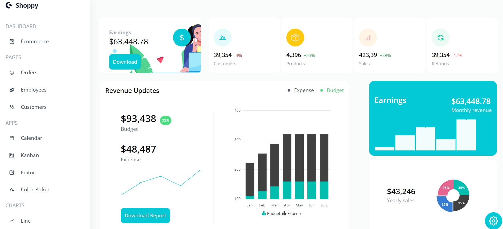

# Shoppy Admin Dashboard

My objetive with building this project was to learn the basics of the new Material UI alternative, Syncfusion. Thanks to it's well-written docs it was a great experience.

---

---

### [See live version](https://shoppy-app.netlify.app/)

### Description

Shoppy is an e-commerce admin dashboard for purely demo purposes, due to the fact that I had to use dummy data to populate the pages, though it definitely has the potential for something much bigger than it currently is. It was developed with React.js, TailwindCSS and Syncfusion. Thanks to syncfusion, implementing advanced features (kanban board, calendar, color picker, unique charts) was mind-blowingly easy.

### Features

- Custom and editable tables for previous orders, the list of emloyees and customers
- Calendar mini-application that is capable of handling events and drag and drop.
- Kanban/trello board for tracking projects
- Built-in word-like text editor
- Color picker
- 9 unique charts (line, area, bar, pie, financial, color-mapping, pyramid, stacked)

### Technologies used

- JSX
- TailwindCSS
- React
- Syncfusion
- Netlify for deployment

### What did I learn?

This project helped me improve my skills in multiple areas.

- I got more experience using React.js hooks, but especially the useContext hook
- Implementation and customisation of syncfusion components
- Lifting the state up, passing functions as props to child components

### Credit

_The project was inspired by [Adrian](https://www.completepathtojavascriptmastery.com/)_
